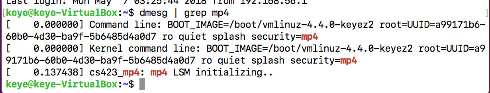

# CS423 MP4: Linux Security Modules
## Due: May.6th, 2018, 4:59AM CDT

### About our custom kernel
After a rebooting of my kernel during the development around May 5th, I found that the VSphere is down and my kernel rebooted to and stayed in the generic one, verified by `uname -r`.

Since now just before the deadline, VSphere is still down and I have no way to change it back to my custom kernel "4.4.0-keyez2" through the Vsphere console, I would appreciate it if I could be exempt from penalty that one is not in his/her custum kernel.

For checking if the security module is running, if you switch to my custom kernel and run `dmesg | grep mp4`, you can see that the security module is initialized, which is from my first compilation:

### Any design decisions that you made during the development of this MP

#### 1.mp4_cred_alloc_blank
For this hook I first allocate a new mp4_security as the new security blob, and set its sid to MP4_NO_ACCESS as default. Then use the cred passed in by this hook and points this cred's `scurity` field to the security blob I just allocated.

#### 2.mp4_cred_prepare
For this hook, a new security blob called `new_blob` is allocated which should be a memory copy of the old security blob referred by `old -> security`, so that the sid field can also be copied. This copying is achieved by `kmemdup` function. And finally, points the new cred's security field to the  `new_blob` we just allocated, so that a new cred is fully duplicated for preparation.

#### 3.mp4_cred_free
For this hook I did error handling such as that `cred->security` may be null, and after that used `kfree` to deallocate the security blob.

#### 4.mp4_bprm_set_creds
For this hook, the goal is to set the credentials for each process that is launched from a given binary file. First, I get the inode of the bprm by `bprm->file->f_inode`, and then use the helper function `get_inode_sid` to get the sid of that inode.

Inside that helper function, the dentry of that inode is get by the `d_find_alias` function, for get the extended file attribute, the function `getxattr` is used.

One thing to notice is that for error handling, since the value returned back by the `getxattr` function is the position the couter is pointing to at the buffer we allocated and passed in to this function. There could be a chance that the buffer size is actually not large enough, which would lead to the case where the returned value is `-ERANGE`, which may cause the kernel to crash.

So a trick to handle this is to use `NULL` and `0` as the last two parameters for function `getxattr`, and it acts like a "query" to ask the right size of buffer needed. After we get this "queried" right size back, we can do the `getxattr` for the second time.

After that the we get the sid back in the hook, if that label reads `MP4_TARGET_SID`
I set the created task’s blob, that is `bprm -> cred -> security -> mp4_flags`, to `MP4_TARGET_SID` as well.

#### 5.mp4_inode_init_security
For this hook, the idea is that the `name` and `value` and `len` attribute are the place where we should set the these value. So the way to do it is that:

For `name`, allocate a `name_pointer` which points to a new memory block, whose string content is the copy of `XATTR_MP4_SUFFIX`, and assign the address of that string to the `name` double pointer.

For `value`, it is also the similar story. For those inodes that were created by a target process, they should always be labeled with the read-write attribute. This is done by also allocating a new `value_pointer` which points to a new memory block, with the string content `target` if the current sid is equal to `MP4_TARGET_SID`, and then also assign the `len` to the size of the string `target`, which is 7 (6 + '\0').

#### 6.mp4_inode_permission
This hook is partially implemented with the function `mp4_inode_permission` completed. The workflow of my code is as follow:

First get dentry of the inode by using `d_find_alias(inode);`.Then, using `d_path` function to get the path of that inode, by passing in the dentry and a buffer. The next step is to use the helper function `mp4_should_skip_path` to check if the path is the path that we should skip, if it return non-zero, we skip these paths, and `dput` the dentry and free the buffer.

If the path is not skipped, then we get the sid and oid, and pass into the function `mp4_has_permission`, which leaves  unimplemented(always return granted access). After get the return value `ret` back. I print some information of the admission for that task, and return 0 or -NO_ACCESS.

### Details about the test cases that you used to verify that your security module is working

Since the Vshpere is down, it took a really long time to install and setup a working virtual box for myself, which is really hard to setup everything. As a result, there are not enough time to for testings, and all the `dmesg` are grepped in my own virtual box.

Create two tests scripts called `test.perm` and `test.perm.unload`:
`test.perm`:
`setfattr -n security.mp4 -v target /bin/cat
setfattr -n security.mp4 -v dir /home
setfattr -n security.mp4 -v dir /home/keye
setfattr -n security.mp4 -v read-only /home/keye/mytest.txt`

`test.perm.unload`:
`setfattr -x security.mp4 -v target /bin/cat
setfattr -x security.mp4 -v dir /home
setfattr -x security.mp4 -v dir /home/keye
setfattr -x security.mp4 -v read-only /home/keye/mytest.txt`

(My netid is `keyez2`, but the name I use in my virtual box is `keye`, and so the home path in my virtual box is `/home/keye/`)

To run the tests:
Source the script by  `source test.perm`
At home directory, `cat mytest.txt`
Finally unloading the script by `source test.perm.unload`
