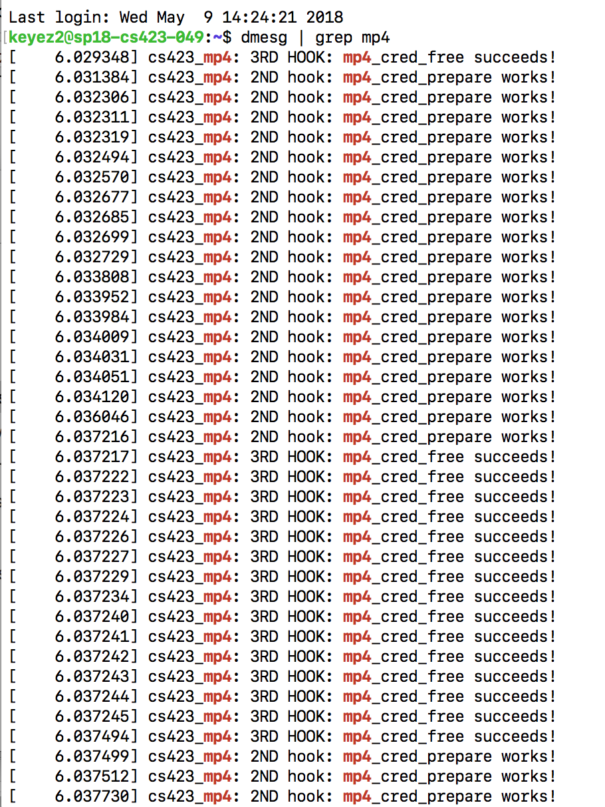
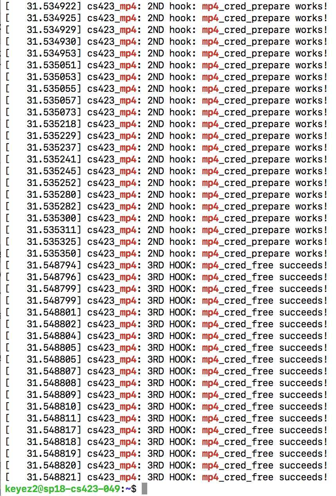
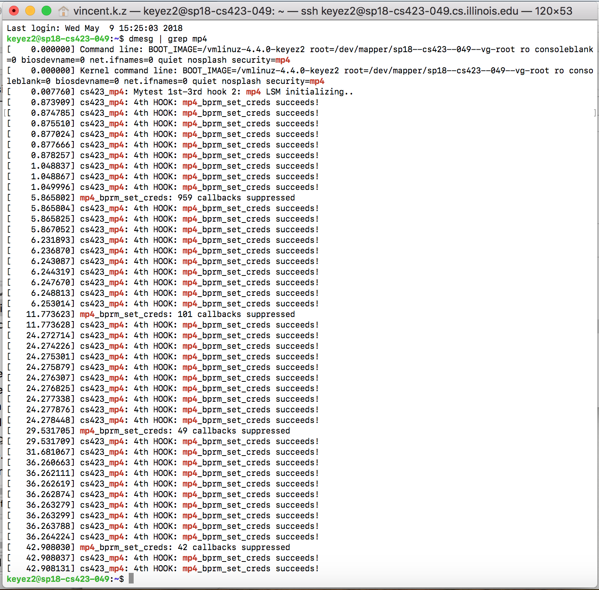
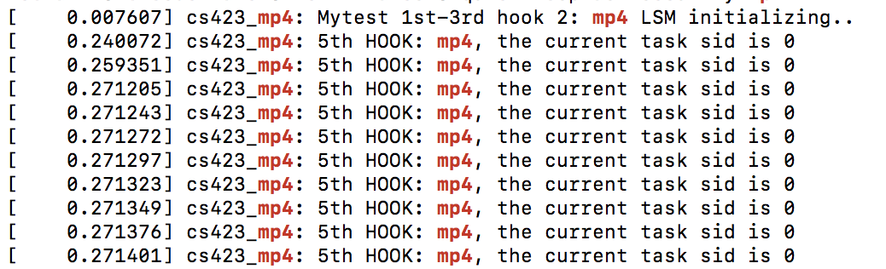
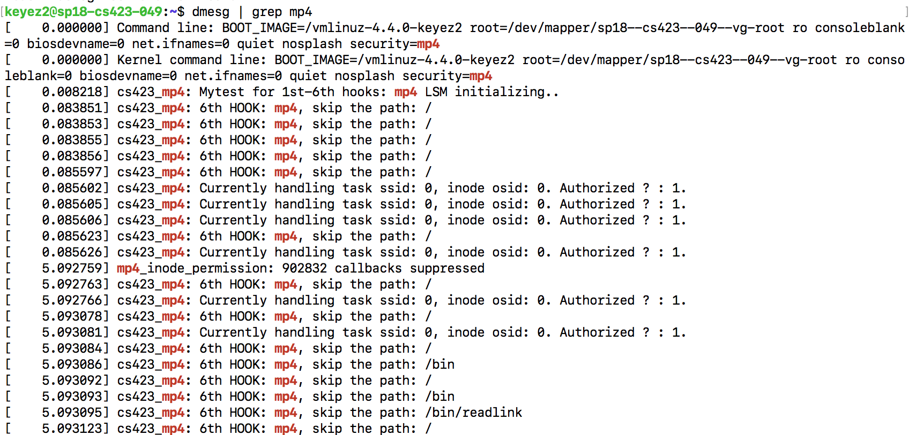
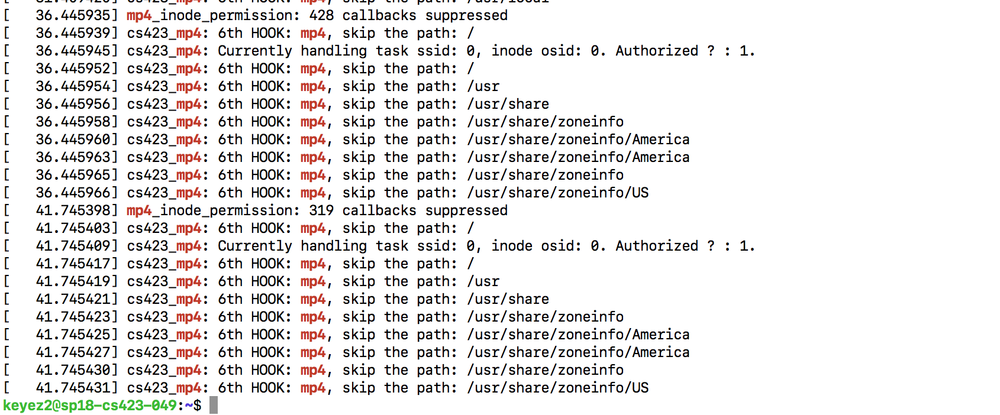

# CS423 MP4: Linux Security Modules
## Due: May.6th, 2018, 4:59AM CDT

### Checking the MP4 Linux Security Module is intitalzed in Kernel
For checking if the security module is running, run `dmesg | grep mp4`, at the very top of the printing logs you can see the message "Mytest for 1st-6th hooks: mp4 LSM initializing..". The screenshot is as follows:

### Any design decisions that you made during the development of this MP

#### 1.mp4_cred_alloc_blank
For this hook I first allocated a new mp4_security as the new security blob, and set its sid to `MP4_NO_ACCESS` as default. Then used the cred passed into this hook and points this cred's `security` field to the security blob I just allocated.

#### 2.mp4_cred_prepare
For this hook, a new security blob called `new_blob` is allocated which should be a deep copy of the old security blob referred by `old -> security`, so that the sid field can also be copied. This copying is achieved by `kmalloc` function followed by setting the label to the same as the old one. Finally, points the new cred's security field to the  `new_blob` we just allocated, so that a new cred is fully duplicated for preparation.

One thing to notice is that if the `old` credential pointer is NULL, we still want to allocate a new security blob, set its label to `MP4_NO_ACCESS`, and let `new`'s security field point to it.  

#### 3.mp4_cred_free
For this hook I did error handling such as that `cred->security` may be null, and after that used `kfree` to deallocate the security blob.

`dmesg` screenshot: Compilation of the first 3 hooks, and the log showing that the MP4 LSM is loaded:

#### 4.mp4_bprm_set_creds
For this hook, the goal is to set the credentials for each process that is launched from a given binary file. First, I get the inode of the bprm by `bprm->file->f_inode` after several error checks, and then use the helper function `get_inode_sid` to get the sid of that inode.

Inside that helper function, the dentry of that inode is get by the `d_find_alias` function, for get the extended file attribute, the function `getxattr` is used.

One thing to notice is that for error handling, since the value returned back by the `getxattr` function is the position the counter is pointing to at the buffer we allocated and passed in to this function. There could be a chance that the buffer size is actually not large enough, which would lead to the case where the returned value is `-ERANGE`, which may cause the kernel to crash.

So a trick to handle this is to use `NULL` and `0` as the last two parameters for function `getxattr`, and it acts like a "query" to ask the right size of buffer needed. After we get this "queried" right size back, we can do the `getxattr` for the second time.

After that the we get the sid back in the hook, if that label reads `MP4_TARGET_SID`
I set the created task’s blob, that is `bprm -> cred -> security -> mp4_flags`, to `MP4_TARGET_SID` as well.

`dmesg` screenshot: Compilation of the 4th hooks, the pr_info is put right where the function's return statement:

#### 5.mp4_inode_init_security
For this hook, the idea is that the `name` and `value` and `len` attribute are the place where we should set the these value. So the way to do it is that:

For `name`, allocate a `name_pointer` which points to a new memory block, whose string content is the copy of `XATTR_MP4_SUFFIX`, and assign the address of that string to the `name` double pointer.

For `value`, it is also the similar story. For those inodes that were created by a target process and are not directories, they should always be labeled with the `read-write` attribute. This is done by also allocating a new `value_pointer` which points to a new memory block, with the string content `read-write` if the current sid is equal to `MP4_TARGET_SID`, and then also assign the `len` to the size of the string `read-write`, which is 7 (10 + '\0').

For those inodes which are directories, we should allow the process to go on. Then a new `value_pointer` is allocated which points to a new memory block, with the string content `dir-write` if the current sid is equal to `MP4_TARGET_SID`, and then also assign the `len` to the size of the string `dir-write`, which is 10 (9 + '\0').

`dmesg` screenshot: Compilation of the 5th hooks:

#### 6.mp4_inode_permission
This hook is partially implemented with the function `mp4_inode_permission` completed. The comparison between the mask and the label is in SeLinux style. The workflow of my code is as follow:

First get dentry of the inode by using `d_find_alias(inode);`.Then, using `dentry_path_raw` function to get the path of that inode, by passing in the dentry and a buffer. The next step is to use the helper function `mp4_should_skip_path` to check if the path is the path that we should skip, if it return non-zero, we skip these paths by granting them access, and `dput` the dentry and free the buffer.

If the path is not skipped, then we get the sid and oid, and pass into the function `mp4_has_permission`, which is the core policy of the MP. The way to design the policy has the purpose of achieving simplicity in code.

1.The task is labeled as target, or, the task is not labeled as targer and also the inode is not a directory, we talk with our current MAC policy to check if the program allowed to access the inode . If yes, access is granted, if not, we denied it and log the attempt.

2.The task is not labeled as targer and also the inode is a directory: we grant it access directly.

After get the return value `ret` back. We `pr_info` those attempt which just got denied.

`dmesg` screenshot: Compilation of the 6th hooks:

### Details about the test cases that you used to verify that your security module is working

I created two tests scripts called `test.perm` and `test.perm.unload` at the home directory:
`test.perm`:

`sudo setfattr -n security.mp4 -v target /bin/cat

 sudo setfattr -n security.mp4 -v dir /home

 sudo setfattr -n security.mp4 -v dir /home/keyez2

 sudo setfattr -n security.mp4 -v read-only /home/keyez2/my_mp4_test.txt`

`test.perm.unload`:

`sudo setfattr -x security.mp4 /bin/cat\

 sudo setfattr -x security.mp4 /home

 sudo setfattr -x security.mp4 /home/keyez2

 sudo setfattr -x security.mp4 /home/keyez2/my_mp4_test.txt`

To run the tests:
Source the script by  `source test.perm`
At home directory, `cat my_mp4_test.txt`
Then unloaded the script by `source test.perm.unload`

Change the `read-only` tag from `test.perm.unload`'s last line to `write-only`, run the test again.

### Provide details about the least privilege policy for /usr/bin/passwd and whether your module was able to correctly implement it.
Create a dummy user: `useradd -M -s /bin/false dummyuser`

Change its password: `sudo passwd dummyuser`

Strace the information during the updating of the password: `sudo strace -o  -e trace=file sudo passwd dummyuser`

Used a python script to extract the least policy by ingoring the path including `"dev", "proc", "lib", "events", "mnt", "run", "lvm", "conf", "usr", "bin", "/"]`

The results is stored in `mp4_policy.txt`, `mp4_policy_after_extraction.txt`, `passwd.perm`

Haven't implemented the last step where we use the module to enforce the policy for /usr/bin/passwd.
